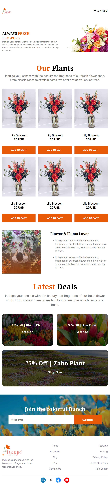
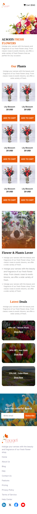

## 🌟 WELCOME TO Flower-Shop ASSIGNMENT-002 😎

---

## ✅ Main Requirements (50 Marks)

### 1. Navbar ( Done )

- **Logo/Website name** on the left
- **Menu items** on the right with **cart icon**
- **Mobile Responsiveness:**
  - Logo/website name on the left
  - Cart icon with name on the right as Figma
  - Other navbar elements will be hidden for cleaner mobile experience
---
` -> **Extra part** `
-
-

---

### 2. Banner ( Done )

- **Image** on the right
- **Title and paragraph** on the left
- **Mobile Responsiveness:**
  - Image moves to the top
  - Content after image
  - Content left aligned as Figma

---

### 3. Plants Section ( Done )

- centered **Title and subtitle** as Figma
- **8 cards with 4 Collumn View** with image, name, price, and Add to cart button
- **Mobile Responsiveness:**
  - Display Cards in 2 Collumn

---

### 4. Plants Lover Section ( Done )

- **Image** on the left
- **Title and unordered list** on the right as Figma
- **Mobile Responsiveness:**
  - Image moves to the top
  - Content after image
  - Content left aligned as Figma

---

### 5. Join Section ( Done )

- centered **Join the colorful Bunch** message
- **Background image** in the full section like Figma
- **Input box with placeholder** and **subscribe button** like Figma
- **Mobile Responsiveness:** Responsive design like Figma

---

### 6. Footer Section ( Done )

- **Website logo** on the left
- **Home, features link items** just like Figma
- **Mobile Responsiveness:** Responsive design like Figma

---

## 🧪 Challenges Part

### Latest Deal Section ( Done )

- **Title and subtitles**
- **Card layout** like Figma
- **Mobile Responsiveness:** Show a card on display like Figma

---

### Trusted Plant Lover Badge ( Done )

- Position a Trusted badge at the **Plant Lover** Image as Figma
- - **Mobile Responsiveness:** Hide the Trusted badge in Mobile Device

---

## 🕛 Optional Part ( Done )

`⚠️ You wont get any support for Optional part. Search Google and try it yourself`

- Create an Animation for Trusted Plant Lover Badge

  - It will Spin infinite times

- Show an Alert with a message `"Flower Added to Cart"` when some one click on **Add to Cart** Button ( Done )

## ⚙️ Technology Stack

- HTML
- CSS (Tailwind CSS is maximum and Vanilla up to 2 / 3 % used )
---

## 📌 Rules

- ✅ Minimum **5 meaningful commits** required. ( -> try to commit meaningfully)
- ❌ No Lorem Ipsum or dummy placeholder text. Use relevant content only. ( -> Done )

---

## 🔗 What to Submit

- 📂 **GitHub Repository:** submit as expect
- 🌐 **Live Link:** submit as expect

---

## 📸 Screenshot ( DeskTop )

---

## 📸 Screenshot ( Tablet )

---

## 📸 Screenshot ( Mobile )

